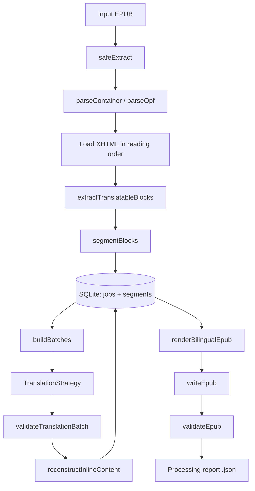
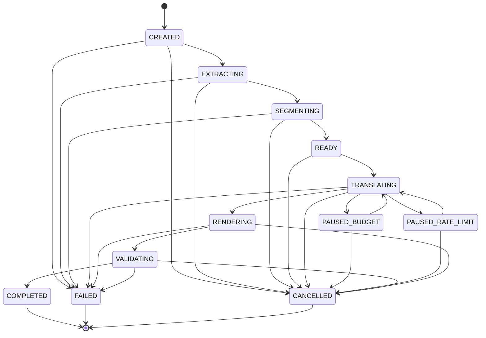
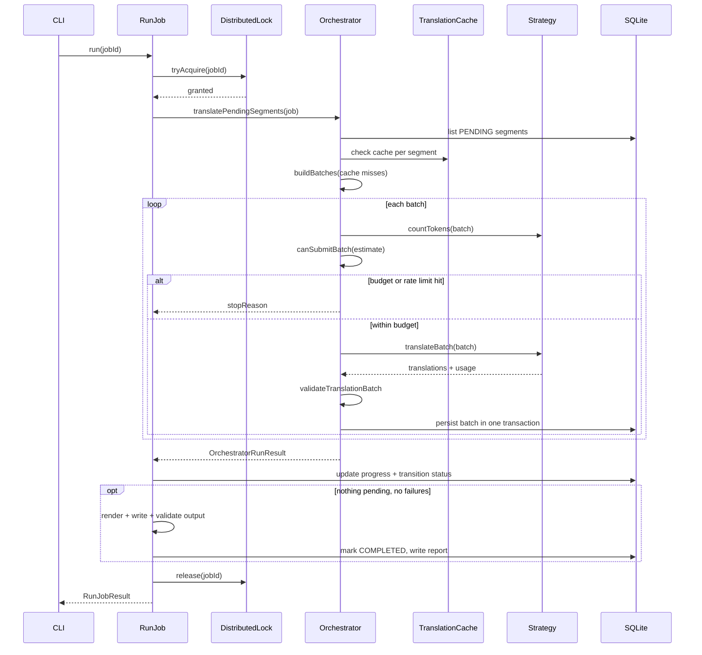

# Architecture overview

A local, budget-aware agent that turns a DRM-free English or French EPUB into a
paragraph-aligned bilingual EPUB. Every LLM call is gated by an explicit
request/run/day/month token budget before it's sent, and every job is a
resumable, kill-safe state machine backed by a single local SQLite file.

Stats: 55 source files · 38 test files · 172 tests passing · 10 build
milestones · 1 local SQLite file. Source of truth for the requirements this
implements: [`bilingual_epub_agent_build_plan.md`](../bilingual_epub_agent_build_plan.md).

## Contents

- [Pipeline flow](#pipeline-flow)
- [Component map](#component-map)
- [Job state machine](#job-state-machine)
- [Run sequence: one batch at a time](#run-sequence-one-batch-at-a-time)
- [Resumability & locking](#resumability--locking)
- [Budget enforcement](#budget-enforcement)
- [Directory structure](#directory-structure)
- [Design decisions](#design-decisions)
- [Error taxonomy](#error-taxonomy)

## Pipeline flow

A book moves through one deterministic pipeline, left to right. The only step
that talks to the network is the translation call in the middle — everything
before and after it is local file/DB work, which is what makes the whole
thing resumable.



Every stage after segmentation reads from and writes back to the same
jobs/segments tables, which is what makes a killed process resumable rather
than corrupt.

| Stage | Implementation | File |
|---|---|---|
| Archive safety | `safeExtract` | `src/epub/safe-archive.ts` |
| Container / OPF parsing | `parseContainer`, `parseOpf` | `src/epub/epub-reader.ts` |
| Block extraction | `extractTranslatableBlocks` | `src/epub/content-extractor.ts` |
| Segmentation | `segmentBlocks` | `src/epub/paragraph-segmenter.ts` |
| Persistence | `JobRepository`, `SegmentRepository` | `src/persistence/*` |
| Batching | `buildBatches` | `src/translation/batch-builder.ts` |
| Translation call | `ClaudeTranslationStrategy` / `MockTranslationStrategy` | `src/translation/providers/*` |
| Response validation | `validateTranslationBatch` | `src/translation/translation-validator.ts` |
| Inline reconstruction | `reconstructInlineContent` | `src/epub/inline-placeholder.ts` |
| Bilingual rendering | `renderBilingualEpub` | `src/epub/bilingual-renderer.ts` |
| Archive rebuild | `writeEpub` | `src/epub/epub-writer.ts` |
| Output validation | `validateEpub` | `src/epub/epub-validator.ts` |
| Report | `buildProcessingReport` | `src/app/processing-report.ts` |

## Component map

Nine layers, each with one job. The App layer is the only thing allowed to
talk to more than one layer at once.

| Layer | Role | Files |
|---|---|---|
| **CLI** | Commander-based commands; parses flags, prints results, never contains business logic. | `index.ts`, `commands/{init,inspect,jobs,validate,estimate,scheduler}.ts` |
| **App** | Orchestration glue — the only layer that wires EPUB + translation + persistence + budget together. | `create-job.ts`, `run-job.ts`, `inspect-book.ts`, `estimate-book.ts`, `render-job.ts` (pre-persistence path), `processing-report.ts` |
| **Domain** | Pure types and the job state machine — no I/O, nothing async. | `job.ts` (JobStatus, transitions), `segment.ts`, `translation.ts` (TranslationStrategy contract), `errors.ts` |
| **EPUB** | Everything that touches the zip archive and its XHTML. | `safe-archive.ts`, `epub-reader.ts`, `epub-writer.ts`, `epub-validator.ts`, `content-extractor.ts`, `paragraph-segmenter.ts`, `inline-placeholder.ts`, `bilingual-renderer.ts`, `xhtml-well-formed.ts`, `link-checker.ts` |
| **Translation** | Provider-agnostic orchestration; the only place an Anthropic SDK type is allowed to exist. | `translation-strategy.ts`, `translation-orchestrator.ts`, `translation-validator.ts`, `batch-builder.ts`, `prompt.ts`, `retry.ts`, `strategy-factory.ts`, `providers/claude-translation-strategy.ts`, `providers/mock-translation-strategy.ts` |
| **Budget** | Pure decision logic — no I/O — for whether a batch is allowed to go out. | `token-budget-manager.ts`, `cost-calculator.ts` |
| **Persistence** | The single SQLite file: jobs, segments, translation cache, usage ledger, locks. | `database.ts` (migration runner), `job-repository.ts`, `segment-repository.ts`, `translation-cache.ts`, `usage-repository.ts`, `migrations/0001–0003` |
| **Scheduler** | Decides *when* to look for due work; every run still goes through the same lock and budget checks. | `scheduler-service.ts`, `distributed-lock.ts` |
| **Config & logging** | Zod-validated environment config and Pino logging with secret redaction. | `config/env.ts`, `config/schema.ts`, `config/presets.ts`, `config/resolve-book-config.ts`, `logging/logger.ts` |

## Job state machine

`JobRepository.transition()` is the only place a job's status can change, and
it rejects anything not listed in `JOB_STATUS_TRANSITIONS`
(`src/domain/job.ts`). The LLM never decides file paths, scheduling,
paragraph IDs, ordering, or completion — it only returns translated text.



`PAUSED_BUDGET` / `PAUSED_RATE_LIMIT` are the only states with an edge back
into `TRANSLATING`: a paused job resumes on the next `run` or scheduler tick,
picking up exactly where it stopped.

## Run sequence: one batch at a time

`runJob()` is what both the CLI's `run` command and the scheduler call. It
acquires a per-job lock, then hands off to the orchestrator, which works
through PENDING segments batch by batch — checking the budget before every
request and persisting every outcome the moment it's known.



A process killed between two batches loses nothing: the last
`DB: persist batch` already committed, and the lock's lease simply expires.

## Resumability & locking

Two mechanisms make "kill the process, restart it" safe:

- **Segment status.** Every paragraph is `PENDING`, `TRANSLATED`, or
  `FAILED`. `translatePendingSegments` only ever selects `PENDING` rows, so a
  second run of the same job can't resend a paragraph that already
  succeeded — there's no separate "resume token" to get out of sync.
- **Lease-based lock.** `job_locks` rows carry an `expires_at`. A second
  `runJob()` call on the same job returns `skippedLocked: true` instead of
  racing the first. If a process crashes while holding the lock, no
  heartbeat or crash detector is needed — the lease simply elapses and the
  job becomes runnable again (30-minute default lease).

## Budget enforcement

Checked in this order, before every batch is sent, with a configurable
safety margin reserved off every limit except the per-request one.

| Scope | Env vars | Notes |
|---|---|---|
| Per request | `MAX_SOURCE_TOKENS_PER_REQUEST`, `MAX_ESTIMATED_OUTPUT_TOKENS_PER_REQUEST` | Hard cap; batch-builder targets under this minus the safety margin. |
| Per run | `MAX_REQUESTS_PER_RUN`, `MAX_INPUT/OUTPUT_TOKENS_PER_RUN` | One `run` invocation. Exceeding it → `PAUSED_BUDGET`. |
| Per day | `MAX_INPUT/OUTPUT_TOKENS_PER_DAY` | Summed across *all* jobs via `usage_ledger`, in `SCHEDULE_TIMEZONE`. |
| Per month | `MAX_INPUT/OUTPUT_TOKENS_PER_MONTH` | Same ledger, month key. |
| Cost (optional) | `MAX_COST_PER_RUN/DAY/MONTH_USD` | Only enforced once `MODEL_*_PRICE_PER_MILLION_TOKENS_USD` is set by the user. |
| Safety margin | `TOKEN_SAFETY_MARGIN_PERCENT` (default 20%) | Reserved off run/day/month limits for response variability and formatting overhead. |

## Directory structure

One package, layered by folder — mirrors the component map above.

```text
src/
├── app/            # orchestration glue: create-job, run-job, inspect/estimate-book, reports
├── budget/         # token-budget-manager, cost-calculator
├── cli/
│   └── commands/   # init, inspect, jobs (translate/run/retry/cancel/status), validate, estimate, scheduler
├── config/         # env.ts, schema.ts (Zod), presets.ts, resolve-book-config.ts
├── domain/         # job.ts (state machine), segment.ts, translation.ts, errors.ts
├── epub/           # reader/writer/validator, extractor, segmenter, renderer, safe-archive, link-checker
├── logging/        # pino logger with secret redaction
├── persistence/
│   └── migrations/ # 0001 jobs+segments · 0002 usage_ledger · 0003 job_locks
├── scheduler/      # scheduler-service (node-cron), distributed-lock
└── translation/
    └── providers/  # claude-translation-strategy, mock-translation-strategy

tests/
├── unit/           # one file per module above, 30 files
├── integration/    # epub round-trip, mock/persisted job pipeline, live-API smoke (opt-in)
└── fixtures/       # build-epub.ts — programmatic EPUB fixtures, incl. a raw malicious zip
```

## Design decisions

The choices that shaped the codebase, and why.

**Deterministic segment IDs.** An ID is a function of chapter path +
position + `sha256(normalizedText)`. Re-running extraction on an unchanged
book reproduces identical IDs; changing a paragraph's text changes its ID,
so stale cache entries can't silently attach to the wrong content.

**Placeholders, not raw HTML, to the LLM.** Inline tags become
`<x-inline data-id="…">` markers before translation. Reconstruction is
stack-based (handles nesting) and *fails closed*: if a placeholder is
dropped or unbalanced, the segment is marked FAILED and the source paragraph
is kept — never malformed XHTML.

**One file, provider-specific types isolated.** `claude-translation-strategy.ts`
is the only file that imports `@anthropic-ai/sdk`. Every SDK error is mapped
to this app's own `AuthenticationError`/`RateLimitError`/`TranslationProviderError`
before it leaves the file.

**SQLite as the only source of truth.** Jobs, segments, the translation
cache, the usage ledger, and locks all live in one local file. Each batch's
outcome is persisted in a single transaction, so a kill mid-run loses at
most the in-flight batch — never a corrupted partial write.

**State machine owns every transition.** `JOB_STATUS_TRANSITIONS` is a
static table, and `JobRepository.transition()` is the only code path allowed
to change a job's status. Nothing — including a future LLM-driven feature —
can skip a stage.

**Leases instead of heartbeats.** `DistributedLock` rows expire on their
own. A crashed holder doesn't need to be detected — the next `tryAcquire`
after the lease elapses just succeeds. Simpler than a heartbeat protocol, at
the cost of a fixed worst-case wait (30 min default) before recovery.

**Batches never split a paragraph.** `buildBatches` packs to a
safety-margined token target and starts a new batch on a chapter boundary
when practical — but a single oversized paragraph still goes out alone
rather than being truncated or dropped.

**Day/month budgets are global.** They protect the provider *account*, not
one book, so `UsageRepository` sums `usage_ledger` across every job — a
second book translated the same day shares the same daily ceiling.

**No hard-coded pricing.** `MODEL_*_PRICE_PER_MILLION_TOKENS_USD` are
optional and user-supplied. Provider pricing changes and varies by tier;
baking in a number would go stale silently. Unpriced usage reports cost as
*unknown*, never `$0`.

## Error taxonomy

All extend `AppError` (`src/domain/errors.ts`) and carry a stable `code` the
CLI prints directly.

| Error | Thrown from | Notes |
|---|---|---|
| `InvalidEpubError` | epub-reader, epub-writer, safe-archive | Not a zip, missing/wrong mimetype, missing mimetype entry. |
| `UnsafeArchiveError` | safe-archive | Path traversal, symlink entry, oversized archive, too many entries. |
| `ManifestResolutionError` | epub-reader | OPF manifest/spine references something that isn't there. |
| `UnsupportedLanguageError` | resolve-book-config | Language outside en/fr, or source == target. |
| `UnsupportedGranularityError` | resolve-book-config | Anything other than `PARAGRAPH`. |
| `AuthenticationError` | strategy-factory, claude-translation-strategy | Missing/invalid API key. Fails the job — never retried. |
| `RateLimitError` | claude-translation-strategy | Caught by the orchestrator → `PAUSED_RATE_LIMIT`, segments stay PENDING. |
| `TranslationProviderError` | claude-translation-strategy | Generic provider failure; carries a `retryable` flag consumed by the backoff helper. |
| `TranslationValidationError` | claude-translation-strategy | Response missing the tool call, or failed Zod schema validation. |
| `TokenBudgetExceededError` | *reserved, not thrown* | Budget stops are currently signaled via `OrchestratorStopReason`, not a throw. |
| `OutputValidationError` | *reserved, not thrown* | Output-validation failure is currently carried as a job `errorMessage` string, not a throw. |
